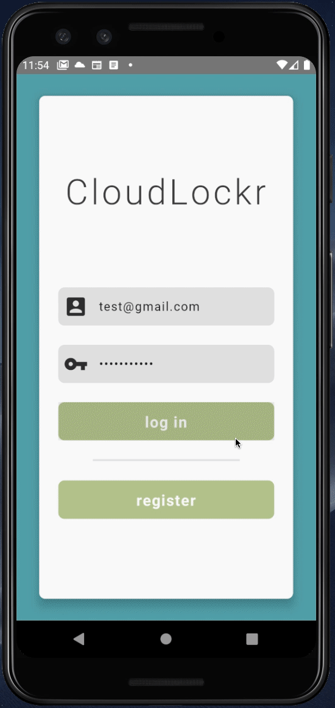
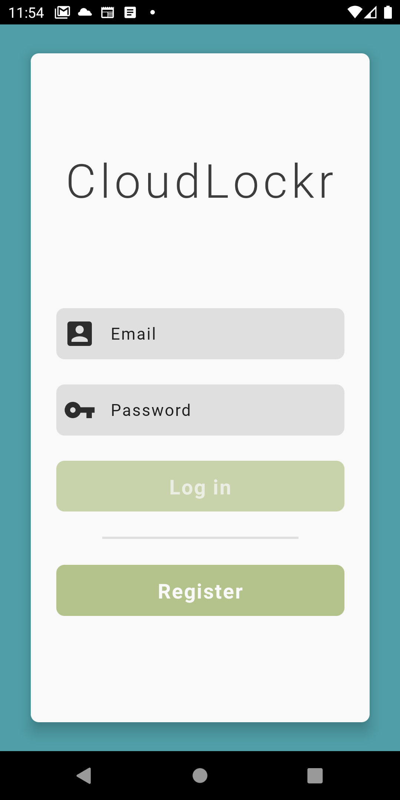
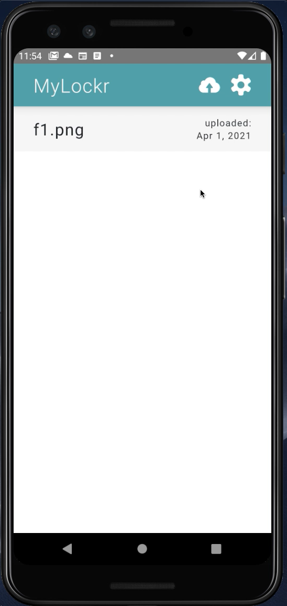
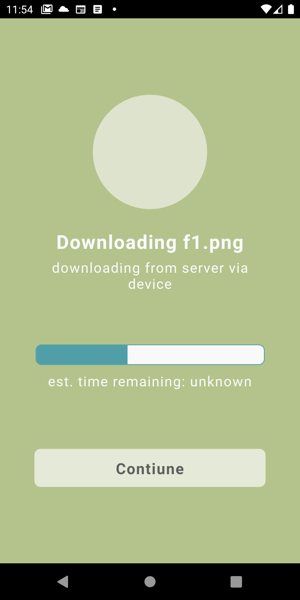

# CloudLockr — React Native Android App

## Project Overview

CloudLockr is an innovative data storage system, tieing your digital data to a physical location while providing secure remote backup storage. The 7 strong layers of protection CloudLockr offers ensures your data is never compromised or read by anyone else, including us.

This repo contains the Android application facilitating the CloudLockr device user interface. This codebase features custom bluetooth communication protocols, location services, API integration, file reconstruction, and user management.

#### Demo (note: lower visual quality and FPS than actual):

#### Screenshots

|                                 |                                 |                                 |                                 |
| :-----------------------------: | :-----------------------------: | :-----------------------------: | :-----------------------------: |
|  |  |  |  |

#### Main Technologies

- React Native
- Jest (testing)
- Axios (remote API connection)
- Redux (data storage)
- react-native-bluetooth-classic (bluetooth communication)
- react-native-fs (file system interaction)
- react-navigation (view navigation)
- react-native-geolocation-service (device location)

---

## Execution Details

#### Project Requirements

- npm
- yarn (latest)

#### How to Simulate on an Android Virtual Device (AVD)

1. Execute `yarn install` (if you have not already)
2. In a terminal window in the project root directory, execute `yarn start`
   - This will start the React Native Metro server
3. In a different terminal window also in the project root directory, execute `yarn android`
   - This will launch an AVD (assuming you already have one configured and installed) and build and load the app onto it

#### How to Simulate on a Real Android Device

1. Execute `yarn install` (if you have not already)
2. Connect your Android device to your computer
3. In a terminal window in the project root directory, execute `yarn start`
   - This will start the React Native Metro server
4. In a different terminal window also in the project root directory, execute `yarn android`
   - This will build and load the app onto the phone

#### Running Tests

Execute `yarn test` to run the entire test suite (UI and service logic tests). Verbose results are enabled by default for result clarity.

#### General Execution Notes
- All features related to bluetooth communcation within the app require communicating through the phone's bluetooth hardware to the CloudLockr device. This will result in features not working as intended when simulating on an AVD as the bluetooth hardware is not present. However, this problem can be resolved by mocking the bluetooth connection when testing without a Cloudlockr device or using an AVD. To configure mocked bluetooth connection, set `mocking.deviceConnection = true` in `src/Config/index.js`, and follow the above simulation step.

---

## Technical Details

#### Directory Structure

Note that throughout the project `@/` is used in import statements and translates to `src` (to enhance code readability). Also note that `index.js` files are used throughout the project to simplify imports and provide a defined interface to a given directory. The general concept of the directory structure is to seperate logic from UI components, enhancing testability and modularity.

- `__tests__` (Jest unit/integration/UI tests)
- `src` (source code)
  - `Assets` (resources used throughout code. Assets are imported in `Theme` and usable through there. Do not import assets directly from here in the UI)
  - `Components`
  - `Config` (constant application variables)
  - `Containers` (top level containers for UI views)
  - `Modals` (special containers for pop-up modals views)
  - `Navigators` (app view navigation handling)
  - `Services` (complex logic, any computations)
    - `Device` (services related to device interaction)
    - `External` (services using other external phone APIs)
    - `FileSystem` (services related to local phone file system or file manipulation)
    - `FileTransfer` (top-level services that faciliate complex file transfer processes)
    - `Server` (services related to server interaction)
    - Note that these files throw errors that the UI must catch (and show to the user if applicable)
  - `Store` (Redux interaction, further broken up by Redux slice indicated by each sub-directory)
  - `Theme` (options effecting style, including assets, fonts, and colours. Import `useTheme()` method in UI to access theme data)

#### Other Details

- Conventional Commits
  - This project follows the commit message style of "Conventional Commits" (conventionalcommits.org). All commits should conform to the standard specification.
